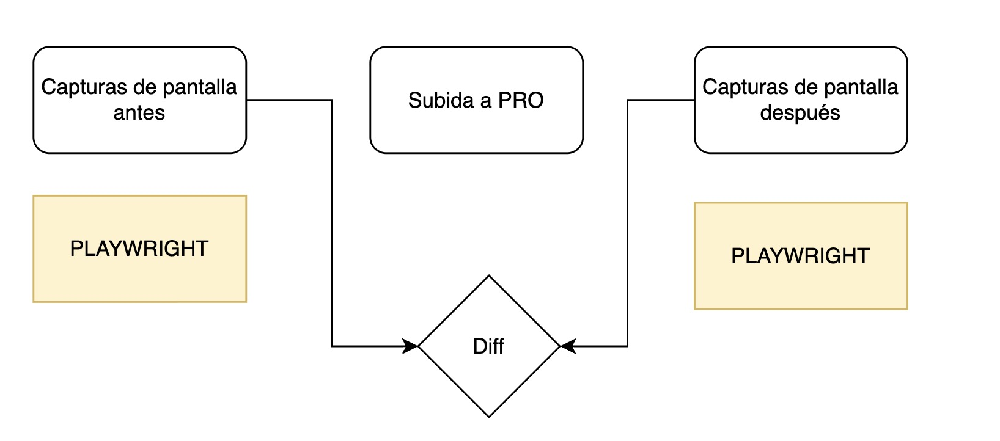
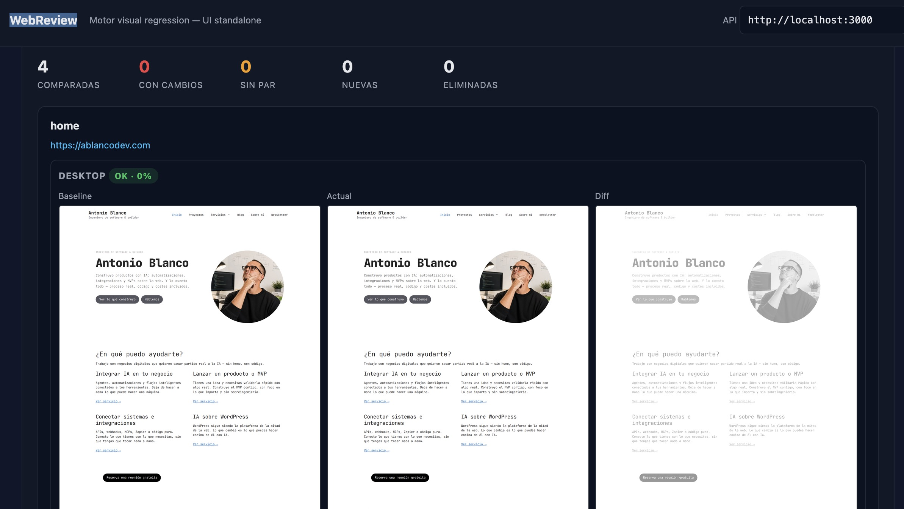

# WebReview — Visual regression standalone

Motor de captura y comparación visual con dashboard web propio. Rastrea o
recorre una lista de URLs, hace capturas full-page a varios breakpoints, guarda
un **baseline** y en cada `check` posterior recaptura y genera imágenes de
**diff** resaltadas con métricas por página.

Todo el stack (motor + UI) se levanta con Docker Compose.



## Ejemplo del dashboard



## Arranque rápido

```bash
docker compose up -d
```

- Dashboard: <http://localhost:8080>
- API del engine: <http://localhost:3000>

Para parar:

```bash
docker compose down
```

## Uso desde el dashboard

1. Pega las URLs a monitorizar (una por línea).
2. Ajusta breakpoints y umbrales si quieres.
3. **📸 Crear baseline** — captura todas y las guarda como referencia.
4. Más tarde, tras cambios en el sitio, **🔍 Comparar (check)** — recaptura
   las mismas URLs y muestra baseline / actual / diff lado a lado con badge
   `ok` / `changed` / `missing` y % de cambio.

La configuración (URLs, breakpoints, endpoint API) se guarda en `localStorage`.

## Uso desde la CLI (sin dashboard)

También funciona como binario Node puro:

```bash
npm install
npx playwright install chromium

node src/index.js baseline https://misitio.com --max 20 --breakpoints desktop,mobile
node src/index.js check   https://misitio.com
```

### Opciones CLI
- `--max <n>` — máximo de páginas a rastrear (def. 20)
- `--breakpoints <a,b>` — `desktop,tablet,mobile` (def. `desktop,mobile`)
- `--threshold <0-1>` — sensibilidad por píxel (def. 0.1)
- `--alert <0-1>` — ratio de cambio para marcar alerta (def. 0.005)

## API HTTP del engine

Puerto `3000`. CORS abierto. Sin auth por defecto (activable con la env
`WEBREVIEW_TOKEN` → `Authorization: Bearer <token>`).

```
POST /jobs           { type: "baseline"|"check"|"discover", url, options }
GET  /jobs/:id       estado, logs y result del job
GET  /data/<ruta>    sirve capturas y diffs estáticos
GET  /health
```

`options` acepta `breakpoints`, `pixelThreshold`, `changeRatioAlert`,
`maxPages`, y `urls` (lista curada — si se pasa, no rastrea, captura tal cual).

## Salida en disco

Dentro del volumen `engine_data` (`/data` en el contenedor):

```
<dominio>/
  baseline/
    manifest.json                    # páginas y capturas del baseline
    crawl.json                       # lista de URLs (se reutiliza en cada check)
    <breakpoint>/<pagina>.png
  runs/<timestamp>/
    <breakpoint>/<pagina>.png
    diff/<breakpoint>/<pagina>.png   # rojo = cambiado
    report.json                      # métricas por página/breakpoint
```

## Cómo reduce falsos positivos
- Congela animaciones/transiciones con CSS inyectado.
- Dispara lazy-load con scroll hasta el fondo antes de capturar.
- Espera `networkidle` + margen de estabilización.
- El `check` reutiliza la lista de URLs del baseline → empareja 1:1.
- Diff con `pixelmatch`; imágenes de distinto alto se rellenan a blanco.

## Estructura del repo

```
src/            Motor Node (crawl, capture, compare, server HTTP)
public/         Dashboard estático (HTML+CSS+JS vanilla)
data/           Capturas locales cuando se usa la CLI (fuera de Docker)
Dockerfile      Imagen del engine (Node + Playwright)
docker-compose.yml
```
